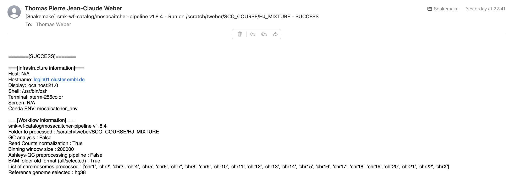

# Snakemake aesthetics

## Code

`workflow/rules/common.smk`

```python
from scripts.utils import make_log_useful, pipeline_aesthetic_start

# Start with aesthetic pipeline config presentation
onstart:
    pipeline_aesthetic_start.pipeline_aesthetic_start(config)


def onsuccess_fct(log):
    make_log_useful.make_log_useful(log, "SUCCESS", config)
    shell(
        'mail -s "[Snakemake] smk-wf-catalog/mosacaitcher-pipeline v{} - Run on {} - SUCCESS" {} < {{log}}'.format(
            config["version"], config["data_location"], config["email"]
        )
    )


def onerror_fct(log):
    make_log_useful.make_log_useful(log, "ERROR", config)
    shell(
        'mail -s "[Snakemake] smk-wf-catalog/mosacaitcher-pipeline v{} - Run on {} - ERRROR" {} < {{log}}'.format(
            config["version"], config["data_location"], config["email"]
        )
    )

if config["email"]:

    onsuccess:
        onsuccess_fct(log)

    onerror:
        onerror_fct(log)
```

`workflow/scripts/utils/pipeline_aesthetic_start.py`

```python
class fg:
    BLACK = "\u001b[30m"
    RED = "\u001b[31m"
    GREEN = "\u001b[32m"
    YELLOW = "\u001b[33m"
    BLUE = "\u001b[34m"
    MAGENTA = "\u001b[35m"
    CYAN = "\u001b[36m"
    WHITE = "\u001b[37m"
    ENDC = "\033[0m"
    BOLD = "\033[1m"
    UNDERLINE = "\033[4m"


def pipeline_aesthetic_start(config):

    sep = """------------------------------------------------------"""

    smk = """
                    _                        _
    ___ _ __   __ _| | _____ _ __ ___   __ _| | _____
    / __| '_ \ / _` | |/ / _ \ '_ ` _ \ / _` | |/ / _ \\
    \__ \ | | | (_| |   <  __/ | | | | | (_| |   <  __/
    |___/_| |_|\__,_|_|\_\___|_| |_| |_|\__,_|_|\_\___|
    """

    wf_name = """
        __  __              _  ___      _      _
    |  \/  |___ ___ __ _(_)/ __|__ _| |_ __| |_  ___ _ _
    | |\/| / _ (_-</ _` | | (__/ _` |  _/ _| ' \/ -_) '_|
    |_|  |_\___/__/\__,_|_|\___\__,_|\__\__|_||_\___|_|
    """
    wf_info = "smk-wf-catalog/mosaicatcher-pipeline v{version}".format(version=str(config["version"]))
    print(sep + fg.GREEN + smk)
    print(fg.ENDC)
    print(fg.YELLOW + wf_name)
    print(fg.ENDC)
    print(fg.MAGENTA + wf_info)
    print(fg.ENDC)
    print(sep)

    # Input / Output
    print("\033[1m{}\033[0m".format("Input/Output options:"))
    l = [
        f"{fg.BLUE}  {{:<50}}{fg.GREEN}{{:<50}}".format("Folder to processed", ": " + str(config["data_location"])),
    ]
    if config["genecore"] is True:
        l.append(
            f"{fg.BLUE}  {{:<50}}{fg.GREEN}{{:<50}}".format("Genecore Folder to processed", ": " + str(config["genecore_date_folder"]))
        )
    [print(e) for e in l]

    print(fg.ENDC)
    # Main options
    print("\033[1m{}\033[0m".format("Main options:"))
    l = [
        f"{fg.BLUE}  {{:<50}}{fg.GREEN}{{:<50}}".format("GC analysis", ": " + str(config["GC_analysis"])),
        f"{fg.BLUE}  {{:<50}}{fg.GREEN}{{:<50}}".format("Read Counts normalization", ": " + str(config["normalized_counts"])),
        f"{fg.BLUE}  {{:<50}}{fg.GREEN}{{:<50}}".format("Binning window size", ": " + str(config["window"])),
    ]
    [print(e) for e in l]

    print(fg.ENDC)
    # Behavior options
    print("\033[1m{}\033[0m".format("Behavior options:"))
    l = [
        f"{fg.BLUE}  {{:<50}}{fg.GREEN}{{:<50}}".format("Genecore mode enabled", ": " + str(config["genecore"])),
        f"{fg.BLUE}  {{:<50}}{fg.GREEN}{{:<50}}".format("Ashleys-QC preprocessing pipeline", ": " + str(config["ashleys_pipeline"])),
        f"{fg.BLUE}  {{:<50}}{fg.GREEN}{{:<50}}".format("BAM folder legacy format (bam/selected)", ": " + str(config["input_bam_legacy"])),
    ]
    [print(e) for e in l]

    print(fg.ENDC)
    # Genome & chrom
    print("\033[1m{}\033[0m".format("Reference genome & Chromosomes options:"))
    l = [
        f"{fg.BLUE}  {{:<50}}{fg.GREEN}{{:<50}}".format("List of chromosomes processed", ": " + ",".join(config["chromosomes"])),
        f"{fg.BLUE}  {{:<50}}{fg.GREEN}{{:<50}}".format("Reference genome selected", ": " + str(config["reference"])),
        # f"{fg.BLUE}  {{:<50}}{fg.GREEN}{{:<50}}".format("Reference FASTA file", ": " + str(config["references_data"][config["reference"]]["reference_file_location"])),
    ]
    [print(e) for e in l]
    print("\n\n")

```

`workflow/scripts/utils/make_log_useful.py`

```python
import sys, os


def make_log_useful(log_path, status, config):

    error_buffer = []
    record = 0
    with open(log_path, "r") as logfile:
        for line in logfile:
            if "error" in line.lower() or "exception" in line.lower():
                if record == 0:
                    error_buffer.append("=== Recording ERROR entry")
                record = 10
                error_buffer.append(line.strip())
            elif line.lower().startswith("[w::") or line.lower().startswith("[e::"):
                if record == 0:
                    error_buffer.append("=== Recording library stderr")
                record = 3
                error_buffer.append(line.strip())
            elif record > 0:
                error_buffer.append(line.strip())
                record -= 1
                if record == 0:
                    error_buffer.append("=== STOP recording error entry")
            else:
                continue

    with open(log_path, "w") as logfile:
        _ = logfile.write("\n".join(error_buffer))
        _ = logfile.write("\n\n")

    my_env = dict(os.environ)
    with open(log_path, "a") as logfile:
        _ = logfile.write("=======[{}]=======\n".format(status))
        _ = logfile.write("\n===[{}]===\n".format("Infrastructure information"))
        _ = logfile.write("Host: {}\n".format(my_env.get("HOST", "N/A")))
        _ = logfile.write("Hostname: {}\n".format(my_env.get("HOSTNAME", "N/A")))
        _ = logfile.write("Display: {}\n".format(my_env.get("DISPLAY", "N/A")))
        _ = logfile.write("Shell: {}\n".format(my_env.get("SHELL", "N/A")))
        _ = logfile.write("Terminal: {}\n".format(my_env.get("TERM", "N/A")))
        _ = logfile.write("Screen: {}\n".format(my_env.get("STY", "N/A")))
        _ = logfile.write("Conda ENV: {}\n".format(my_env.get("CONDA_DEFAULT_ENV", "N/A")))

        _ = logfile.write("\n===[{}]===\n".format("Workflow information"))
        _ = logfile.write("smk-wf-catalog/mosacaitcher-pipeline v{version}\n".format(version=str(config["version"])))
        _ = logfile.write("Folder to processed : {}\n".format(str(config["data_location"])))
        _ = logfile.write("GC analysis : {}\n".format(str(config["GC_analysis"])))
        _ = logfile.write("Read Counts normalization : {}\n".format(str(config["normalized_counts"])))
        _ = logfile.write("Binning window size : {}\n".format(str(config["window"])))
        _ = logfile.write("Ashleys-QC preprocessing pipeline : {}\n".format(str(config["ashleys_pipeline"])))
        _ = logfile.write("BAM folder old format (all/selected) : {}\n".format(str(config["input_bam_legacy"])))
        _ = logfile.write("List of chromosomes processed : {}\n".format(str(config["chromosomes"])))
        _ = logfile.write("Reference genome selected : {}\n".format(config["reference"]))
        _ = logfile.write("\n"

    return

```

## Result

### Pipeline Start


### Mail on success


